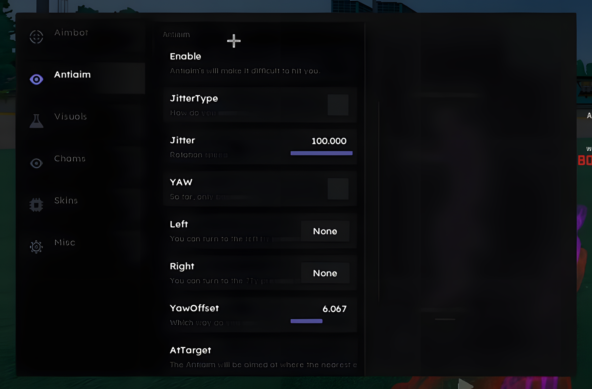

<div align="center">

# 𝔞𝔰𝔭𝔥𝔶𝔵𝔦𝔞

⊹ **𝐩𝐫𝐢𝐯𝐚𝐭𝐞 𝐜𝐬𝟐 𝐢𝐧𝐭𝐞𝐫𝐧𝐚𝐥 𝐟𝐫𝐚𝐦𝐞𝐰𝐨𝐫𝐤** ⊹

[](https://en.cppreference.com/w/cpp/20)
[](https://www.microsoft.com/windows)
[](https://premake.github.io/)
[]()

<br />

<div align="center">
  
</div>

<br />

</div>

---


### ◈ Overview
**asphyxia** — это высокопроизводительный внутренний (internal) чит для Counter-Strike 2, построенный на базе современного C++20. Продукт ориентирован на стабильность и расширяемость, используя передовые методы перехвата функций и динамическое получение смещений через систему Schema.

◈ **Почему это существует**: Создано как надежная база для приватных сборок с упором на минимизацию обнаружения и максимальную производительность рендеринга.
◈ **Для кого**: Для разработчиков и опытных пользователей, понимающих принципы работы internal-софта.

### ◈ Features
*   **Engine & SDK**: Полная поддержка Source 2 Schema System для автоматического обновления офсетов.
*   **Visuals**: Высокопроизводительный ESP, Chams, Overlay на базе D3D11 и ImGui.
*   **Movement**: BunnyHop, AutoStrafe и другие вспомогательные функции.
*   **Inventory**: Встроенный Inventory/Skin Changer с поддержкой дампов.
*   **Internal Core**: Использование SafetyHook и MinHook для безопасных патчей памяти.

### ◈ Tech Stack
| Component | Technology | Role |
| :--- | :--- | :--- |
| **Language** | C++20 | Core logic & performance |
| **GUI** | ImGui | Menu & Overlay |
| **Hooking** | SafetyHook / MinHook | Function interception |
| **Rendering** | DirectX 11 / FreeType | Graphics & Text rasterization |
| **Build System** | Premake5 | Project generation |

---

### ◈ Setup

> ⚠ **Этот проект требует ручной конфигурации перед использованием.**

Поскольку Counter-Strike 2 регулярно обновляется, некоторые сигнатуры и индексы виртуальных таблиц могут устареть.

1.  **Обновление сигнатур**:
    *   Проверьте файл `cstrike/core/interfaces.cpp`.
    *   Найдите вызовы `MEM::FindPattern`. Если игра обновилась, используйте дампер (например, CS2-Dumper), чтобы найти новые паттерны для `SwapChain`, `GlobalVars` и `Input`.
2.  **Зависимости**:
    *   Убедитесь, что в папке `dependencies/freetype/binary` присутствуют необходимые `.lib` файлы.
3.  **Генерация проекта**:
    *   Скачайте [Premake 5.0](https://premake.github.io/download/).
    *   Запустите команду в корневой директории:
        ```ps1
        ./premake5.exe vs2022
        ```
4.  **Сборка**:
    *   Откройте сгенерированный `UNDERAGER.sln` в Visual Studio 2022.
    *   Установите конфигурацию: `Release | x64`.
    *   Выполните `Build Solution` (Ctrl+Shift+B).

---

### ◈ Usage
После успешной сборки вы получите файл `cstrike.dll` в директории `build/Release/`.

1.  Запустите Counter-Strike 2.
2.  Используйте любой надежный инжектор (Process Hacker 2, Extreme Injector и т.д.).
3.  Метод инъекции: `Manual Map` или `LoadLibrary` (рекомендуется Manual Map для безопасности).
4.  В игре:
    *   **INSERT**: Открыть/закрыть меню.
    *   **END**: Экстренная выгрузка (Panic Key).

### ◈ Config
Логи и конфигурационные файлы сохраняются в папке пользователя:
`Documents\UNDERAGER_logs\`

*   `schema.txt`: Дамп всех классов и полей игры.
*   `convars.txt`: Список всех консольных переменных.
*   `settings.json`: Ваши текущие настройки чита.

### ◈ Structure
<details>
<summary>Просмотр дерева репозитория</summary>

```text
asphyxia/
├── cstrike/                # Основной код DLL
│   ├── core/               # Ядро: хуки, интерфейсы, меню
│   ├── sdk/                # SDK для работы с движком Source 2
│   ├── features/           # Реализация функций (Aimbot, Visuals и др.)
│   └── utilities/          # Вспомогательные классы (Math, Memory, Log)
├── dependencies/           # Внешние библиотеки (ImGui, MinHook, FreeType)
├── resources/              # Шрифты и изображения
├── premake5.lua            # Скрипт сборки
└── UNDERAGER.sln           # Файл решения Visual Studio
```
</details>

---
LICENSE: MIT
